### Pocket Pass – User Guide

This document lives at `./user-guide/README.md` and is intended for end‑users of the Pocket Pass hardware password vault.

Pocket Pass is an offline password manager that stores everything on an SD card and never connects to the internet. All passwords are encrypted with AES‑256‑GCM and keys derived from:

- Your **6‑digit passcode**
- A **per‑device secret**
- A **Recovery Key** (shown once during setup)

> **Important:** Without your passcode **and** Recovery Key, your encrypted data cannot be recovered.


---

#### Table of Contents

1. [Quick overview](#quick-overview)
2. [Controls & navigation](#controls--navigation)
3. [Startup & first‑time setup](#startup--first-time-setup)
4. [Unlocking and auto‑lock](#unlocking-and-auto-lock)
5. [Creating and managing categories](#creating-and-managing-categories)
6. [Adding and managing passwords](#adding-and-managing-passwords)
7. [Password history (archives) and rotation](#password-history-archives-and-rotation)
8. [Importing passwords from spreadsheet](#importing-passwords-from-spreadsheet)
9. [Exporting passwords to JSON](#exporting-passwords-to-json)
10. [Updating password generation settings](#updating-password-generation-settings)
11. [Updating security level, PIN & Recovery Key](#updating-security-level-pin--recovery-key)
12. [Accessing the SD card via USB (Access SDCard mode)](#accessing-the-sd-card-via-usb-access-sdcard-mode)
13. [Firmware update from SD card](#firmware-update-from-sd-card)
14. [Backups, recovery & device migration](#backups-recovery--device-migration)
15. [Security features & limits](#security-features--limits)
16. [Troubleshooting](#troubleshooting)


---

### Quick overview

- **Offline only**: No Wi‑Fi/Bluetooth. Data lives on the SD card.
- **Encrypted vault**: Vault stored in `vault.db` on the SD card under `pocketPass/`, encrypted with AES‑256‑GCM.
- **6‑digit passcode**: Required to unlock the device.
- **Recovery Key**: Shown once at first setup; required for recovery or migration.
- **Categories & items**:
  - Up to **60 categories**
  - Up to **60 passwords per category**
- **USB HID keyboard**: The device types passwords directly into your computer as if it were a keyboard.
- **Import/Export**:
  - Import from a simple CSV‑style `.csv` file: `/import/data.csv`
  - Export to JSON: `/export/data.json`
- **Auto‑lock**: Automatically locks after 5 minutes of inactivity.
- **Lockout**: After too many wrong PIN attempts you must use Recovery Mode.

---

### Controls & navigation

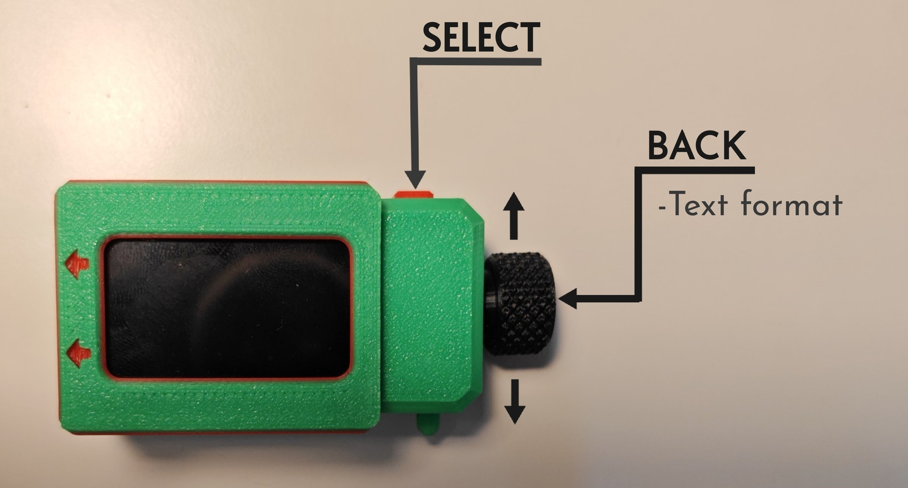


- **Rotary encoder**: Scroll up/down through menus.
- **SELECT button**: Confirm the highlighted option.
- **BACK button**: Go back or close a dialog.
- **BACK button**: Also as Text format when in text input mode.
  - Uppercase: as uppercase letter
  - Lowercase: as lowercase letter
  - Number: Use the numeric keys to input numbers
  - Symbols: Use the SYM key to access special characters.
  - Action: "BACK" is backspace and "SPACE" is a space character.
  - Save: Use for confirmation and Quit is for cancel input.

<table cellpadding="10" cellspacing="10">
  <tr>
    <td align="center">
      <br>
      <sub>Uppercase</sub>
    </td>
    <td align="center">
      <br>
      <sub>Lowercase</sub>
    </td>
    <td align="center">
      <br>
      <sub>Number</sub>
    </td>
  </tr>
  <tr>
    <td align="center">
      <<br>
      <sub>Symbols</sub>
    </td>
    <td align="center">
      <<br>
      <sub>Action</sub>
    </td>
    <td align="center">
      <<br>
      <sub>Save</sub>
    </td>
  </tr>
</table>


General rules:

- Rotate encoder or press UP/DOWN to move selection.
- Press SELECT to trigger the highlighted action.
- Press BACK to return to the previous screen or cancel or change text format.

[](https://www.youtube.com/shorts/38DyTYe2GNk)


---


### Startup & first‑time setup

[](https://www.youtube.com/watch?v=HyMy2jPYt1g)
#### Power‑on

1. Insert a **formatted SD card** into the device.
2. Power on the device (USB power).
3. The logo and firmware version screen appears:
4. If no vault exists, the device starts the **first‑time setup wizard**.

#### Step 1 – Welcome information

- A welcome/info screen explains:
  - You will set a **6‑digit PASSCODE**.
  - A **Recovery Key** will be shown once.
  - Both are required to restore on another device.

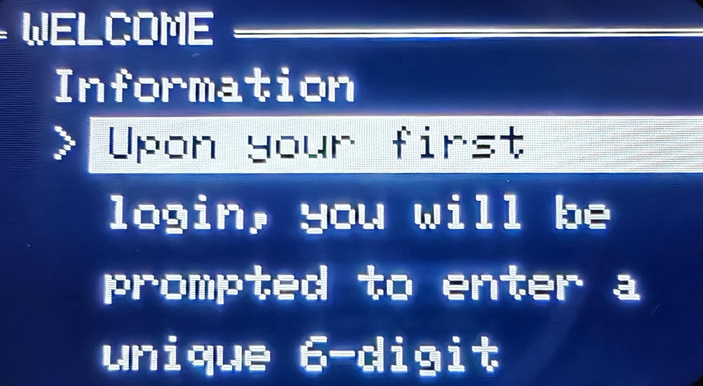

Press **[ NEXT TO PASSCODE ]** to continue with select button.


#### Step 2 – Choose your 6‑digit passcode

1. You are asked to **enter a 6‑digit PIN**, then **confirm it**.
2. Use the rotary + SELECT to enter digits.
3. If the two entries don’t match, you’ll see **“PIN mismatch”** and must try again.

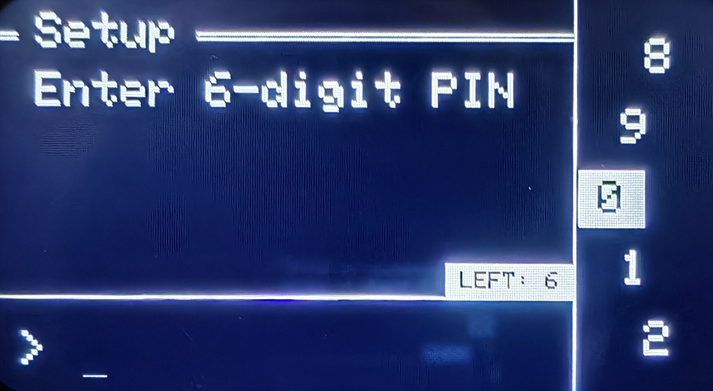

> **Tip:** Choose a PIN you can remember but others cannot easily guess. Do not reuse your bank PIN.

#### Step 3 – Select security level (KDF strength)
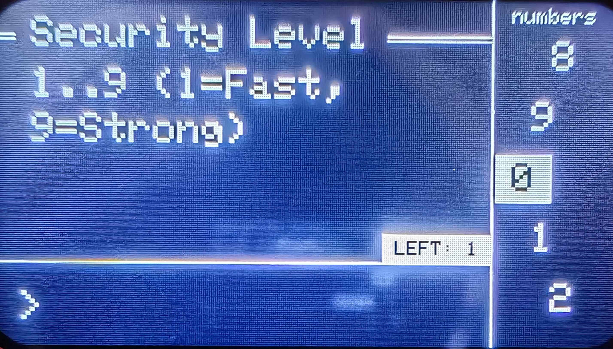<br>
Next, you choose a **Security Level** from **1 to 9**:


- `1` = Fast (quicker unlock, lower KDF cost)
- `9` = Strong (slower unlock, higher KDF cost)

Internally, this controls the number of PBKDF2 iterations. Higher levels are more resistant to brute‑force attacks, but take longer to unlock.

#### Step 4 – Recovery Key (shown once)

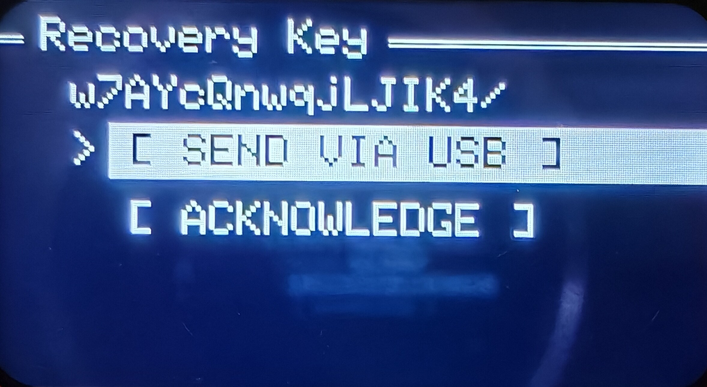<br>

After the vault is created:

1. A **Recovery Key** (Base64 string) is generated and shown on screen.
2. You will see options like:

   - `[ SEND VIA USB ]` – Type the Recovery Key into your PC as keyboard text
   - `[ ACKNOWLEDGE ]` – Confirm you’ve stored it safely


> **Important:**
> - Write this Recovery Key on paper and store it securely (e.g., safe).
> - Anyone with your SD card + PIN + Recovery Key can decrypt your vault.
> - If you lose both PIN and Recovery Key, your data cannot be recovered.

After acknowledging, the device finishes initialization and shows the **main menu**.

If you have alot of passwords need to be insert, i suggest to use the import feature to speed up the process. [Importing passwords from spreadsheet](#importing-passwords-from-spreadsheet)

---

### Unlocking and auto‑lock

[](https://www.youtube.com/shorts/vrPvXE7K-zU)


#### Normal unlock

On each boot (or after auto‑lock):

1. The device prompts: **“Unlock – Enter 6‑digit PIN”**.
2. Enter your PIN using the text input UI.


If successful:

- The vault is decrypted in memory.
- Password subkeys are derived.
- Categories and items are loaded from the SD card.
- You land on the **main Category list**.

#### Failed attempts & lockout

- The device tracks failed unlock attempts.
- After each wrong PIN, you may see an **Unlock Failed** menu:

  - `[ Retry Passcode ]`
  - `[ Enter Recovery Mode ]`

- After too many failures (default: 6), the device **locks out** normal PIN login:
  - You will only see a **Recovery Mode** option.
  - Use your **PIN + Recovery Key** to recover.

#### Auto‑lock (inactivity timeout)

- If there is **no input for 5 minutes**, the device:
  - Wipes keys from RAM.
  - Closes the database.
  - Reboots back to the PIN screen.

This protects you if you forget to lock the device after use.

---

### Creating and managing categories

Categories help group your passwords (e.g., “Email”, “Banking”, “Social”).

#### View main menu

After unlock, you see:

- A list of category names
- At the bottom:
  - `[ ADD CATEGORY ]` (until 60 categories reached)
  - `[ SETTING ]`

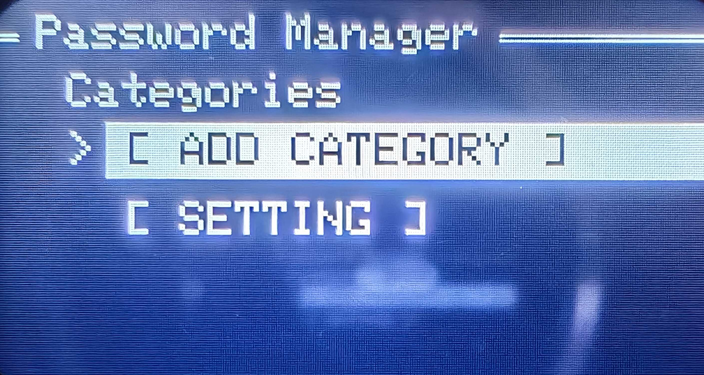<br>


#### Add new category

1. On the main menu, scroll to **`[ ADD CATEGORY ]`**.
2. Press **SELECT**.
3. Enter the category name (up to 16 characters).
4. Confirm to save.

A new category is created and sorted alphabetically.

> **Limit:** Up to **60 categories** total.

#### Edit a category name

1. Open a category (SELECT on the category name).
2. Scroll to **`[ EDIT CATEGORY ]`**.
3. Enter the new name.
4. Confirm.

The category is renamed and the list is re‑sorted.

#### Delete a category

1. Open the category.
2. If it has **no passwords**, you will see **`[ DELETE CATEGORY ]`**.
3. Select it and confirm.

> **Note:** Categories can only be deleted when **empty**. Move or delete passwords first.

---

### Adding and managing passwords

Each category contains a list of password entries (items).

#### Open a category

From the main menu:

1. Use the encoder to highlight a category.
2. Press **SELECT**.
3. You’ll see:

   - A list of existing entries (e.g., “Gmail”, “Facebook”)
   - `[ ADD PASSWORD ]`
   - `[ EDIT CATEGORY ]`
   - Optional `[ DELETE CATEGORY ]` (if empty)
   - `[ BACK ]`

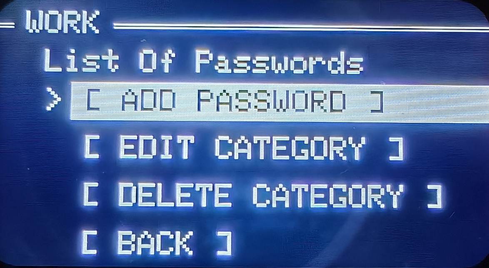<br>


#### Add a new password


1. Inside the category, choose **`[ ADD PASSWORD ]`**.
<br>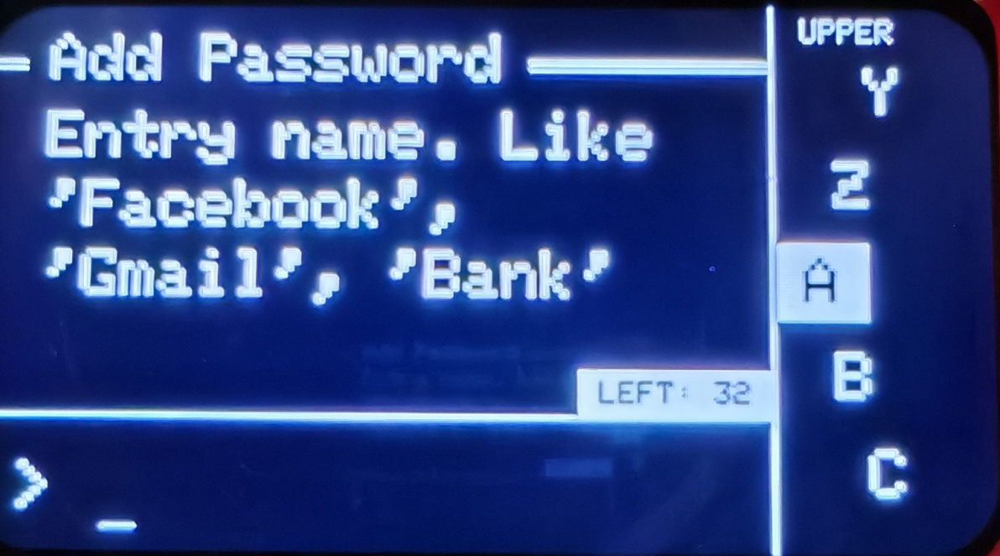<br>
2. Enter the **entry name / label** (e.g., “Gmail”).
3. Choose how to define the password:
   - `[ AUTO GENERATE ]`
   - `[ MANUAL DEFINE ]`
   - `[ CANCEL ]`

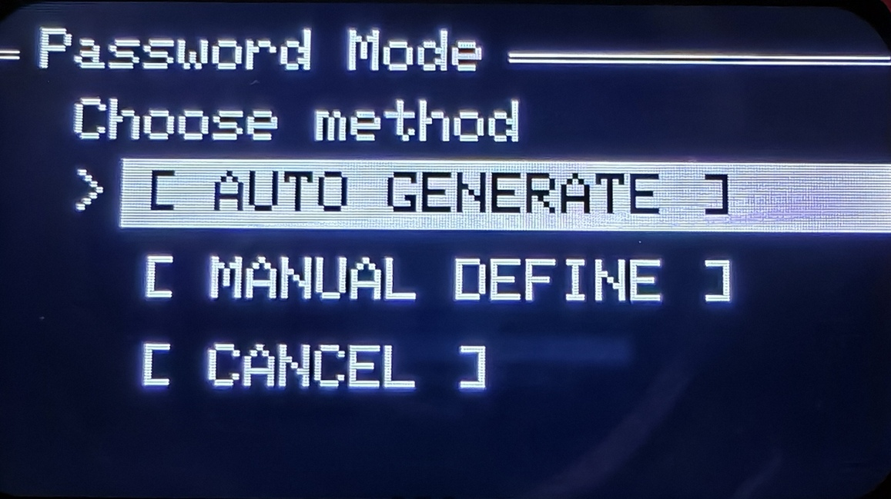<br>

If you choose **AUTO**:

- A password is generated based on your current **Password Settings** (see section below).

If you choose **MANUAL**:

- You can type a custom password (up to 64 characters).

The entry is then:

- Given a random internal ID.
- Encrypted and stored in the vault.
- Inserted into the category, sorted by name.

> **Limit:** Up to **60 passwords per category**.

#### View / use a password

1. In the category list, highlight an entry and press **SELECT**.
2. The **Password Actions** menu appears:

   - `[ SEND PASSWORD ]` – Types the password over USB as a keyboard
   - `[ SHOW PASSWORD ]` – Displays password on screen
   - `[ ROTATE PASSWORD ]` – Generate or set a new password, archive the old one
   - `[ SHOW ARCHIVES ]` – View older versions of that password
   - `[ EDIT NAME ]` – Rename the entry
   - `[ MOVE TO CATEGORY ]` – Move to another category
   - `[ DELETE ]`
   - `[ BACK ]`

<br>

**SEND PASSWORD**

- Focus your PC’s password field.
- Choose `[ SEND PASSWORD ]`.
- The device types the full password via USB HID.

**SHOW PASSWORD**

- Shows the full password briefly on screen (masked preview in the subtitle).
- Good for manually entering it elsewhere.

> The password is wiped from RAM after use.

#### Edit an entry name

From the password actions menu:

1. Select **`[ EDIT NAME ]`**.
2. Enter the new name (e.g., “Gmail”).
3. Confirm.

#### Move a password to another category

From the password actions menu:

1. Select **`[ MOVE TO CATEGORY ]`**.
2. Choose the destination category from the list.
3. Confirm.

> Destination category must have space (max 60 passwords).

#### Delete a password

From the password actions menu:

1. Select **`[ DELETE ]`**.
2. You must type `DEL` to confirm.
3. The item is removed from:
   - Current category list
   - Database and password history


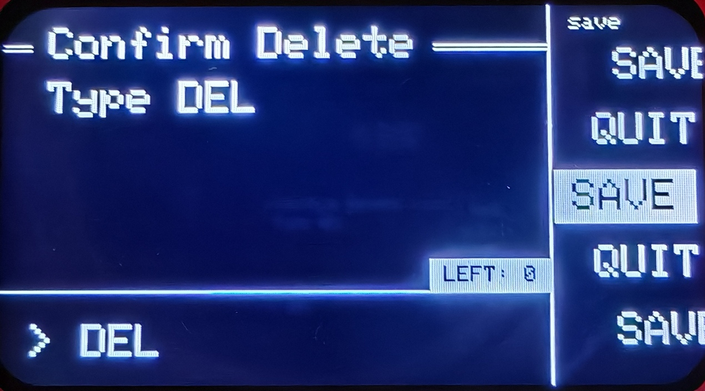<br>
---

### Password history (archives) and rotation

The device keeps an **archive** whenever you **rotate** a password.

#### Rotate a password

[](https://www.youtube.com/shorts/YV-oQ6_ddLY)


From the password actions menu:

1. Select **`[ ROTATE PASSWORD ]`**.
2. Choose:
   - `[ AUTO GENERATE ]` – New random password using current settings.
   - `[ MANUAL DEFINE ]` – Type a new password yourself.
   - `[ CANCEL ]` – Abort.

3. If rotation succeeds:
   - The old password is stored in **history**.
   - The new password becomes the active one.

#### View archived passwords

1. From the password actions menu, select **`[ SHOW ARCHIVES ]`**.
2. You’ll see an archive viewer showing:

   - Entry name
   - Archive index (e.g. “arch 1/3”)
   - Masked preview of that archived password

3. Options:

   - `[ SEND PASSWORD ]` – Type the archived password via USB.
   - `[ SHOW PASSWORD ]` – Display on screen.
   - `[ NEXT ]` / `[ PREV ]` – Move through history.
   - `[ BACK ]` – Exit archives.

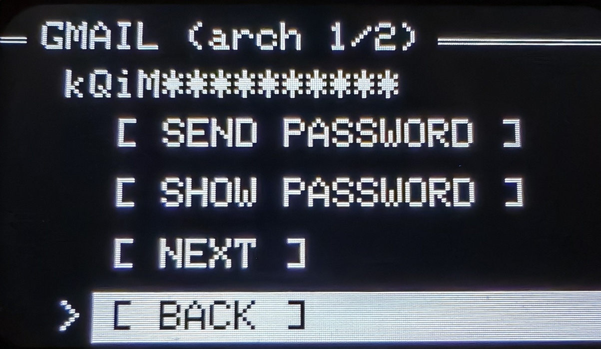<br>
---

### Importing passwords from spreadsheet

[](https://www.youtube.com/watch?v=KUuFH5pSic8)


Import allows you to bulk‑add many entries using a simple CSV‑style file.

#### Step 1 – Prepare import mode

1. Unlock the vault.
2. Go to **`[ SETTING ]`** in the main menu.
3. Choose **`[ IMPORT ]`**.

The device will:

- Ensure an `/import` directory exists on the SD card.
- Create a template file `/import/data.csv` (actually CSV text with an `.csv` name).
- Create `/import/readme.md` with usage instructions.
- Ask you to **“ENTER USB MODE”** and then reboot into **SD Card Mode** (USB Mass Storage).

#### Step 2 – Connect to your computer

- Connect the device via USB.
- Your computer should detect the SD card as a removable drive (it will took about 30sec to appear).
- Navigate to the `/import` folder.

You should see:

- `data.csv`
- `readme.md`

#### Step 3 – Edit `data.csv`

Treat `data.csv` as a **simple CSV** with these columns:

1. `Category`
2. `Label`
3. `Password` (optional)

Example rows:

```text
Category,Label,Password
Work,Gmail,myStrongPass123!
Personal,Gmail,
Banking,My Bank,
Social,Twitter,@SuperSecret!
```

Rules:

- **Do not use commas** or **;** or **double quotes** inside values (simple CSV).
- If `Password` is empty, the device will **auto‑generate** a password when importing.
- Category names are **case‑sensitive**:
  - If the category doesn’t exist, it will be created automatically (until max 60).

Save the file and safely eject/unmount the SD card from your computer.

#### Step 4 – Import on next unlock

1. Disconnect USB and reboot the device (if it hasn’t already).
2. Unlock the vault with your PIN.
3. On unlock, the device checks for `/import/data.csv`:
   - If found, it parses and imports each row.
   - It shows a summary (imported vs skipped).
   - It **deletes `data.csv`** after import for safety.


> **Tip:** If some rows were skipped, see the serial log (for advanced users) or re‑check your CSV formatting.

---

### Exporting passwords to JSON (`/export/data.json`)

Export lets you create a plaintext backup or migrate data to another tool.

> **Warning:** `data.json` contains **unencrypted passwords in plaintext**. Handle with extreme care.

#### Step 1 – Start export

1. Unlock the vault.
2. From main menu → **`[ SETTING ]`**.
3. Select **`[ EXPORT ]`**.

The device will:

- Ensure `/export` exists.
- Delete any old `/export/data.json`.
- Create `/export/readme.md` describing the JSON format.
- Write `/export/data.json` with structure:

  ```json
  {
    "version": 1,
    "entries": [
      { "Category": "Work", "Label": "Gmail", "Password": "..." },
      ...
    ]
  }
  ```

4. Show an **“Export ready”** message and then enter **USB SD Card Mode**.

#### Step 2 – Copy `data.json` to your computer

1. Connect the device via USB.
2. Open the removable drive, go to `/export`.
3. Copy `data.json` to your secure location.
4. **Delete** `data.json` from the SD card when finished, or at least from your PC.

When you reboot the device later, it will remove `/export/data.json` automatically for safety.

---

### Updating password generation settings

The built‑in generator uses four character groups:

- **UPPERCASE** letters
- **LOWERCASE** letters
- **SYMBOL** characters
- **NUMBER** digits

You can control how many of each group to include.

#### Change password settings

1. From main menu, go to **`[ SETTING ]`**.
2. Select **`[ PASSWORD SETTING ]`**.

You will see something like:

- `UPPERCASE 4`
- `LOWERCASE 4`
- `SYMBOL 3`
- `NUMBER 3`
- `[ BACK ]`

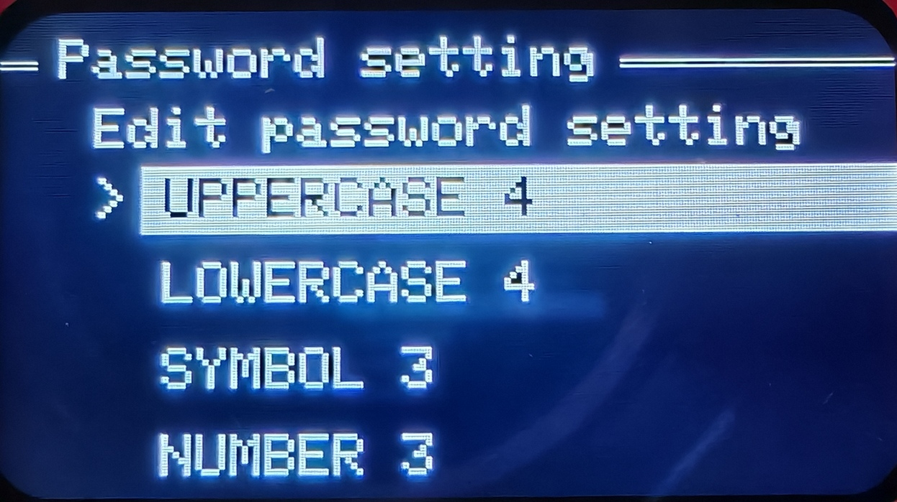<br>


3. Select an item (e.g., `UPPERCASE 4`).
4. Enter a number between `0` and `16`.
5. Confirm. The changes are saved immediately.

These settings are used when:

- You choose **AUTO GENERATE** while adding a new password.
- You choose **AUTO GENERATE** while rotating a password.
- The import file leaves the `Password` field empty.

> Example: If you set UPPERCASE=4, LOWERCASE=4, SYMBOL=3, NUMBER=3, generated passwords will have 14 characters total, shuffled.

---

## Updating security level, PIN & Recovery Key

[](https://www.youtube.com/shorts/yq6r9CHw8vY)


The **`[ UPDATE SECURITY ]`** option lets you:

- Change the **security level** (KDF iteration count → how long unlock takes).
- Change your **6‑digit PIN**.
- Generate a **new Recovery Key** and re‑bind it to your vault.

Internally, the vault’s master key stays the same, but it is **re‑wrapped** with new parameters:

- New PBKDF2 iteration count (based on your chosen security level).
- New PIN.
- New Recovery Key.

> **Important:**
> - You **must know your current PIN** to use `[ UPDATE SECURITY ]`.
> - Your **old Recovery Key becomes invalid** for future recoveries.
> - You **must** store the **new Recovery Key** safely after this operation.

### When to use `[ UPDATE SECURITY ]`

Typical scenarios:

- You want to **strengthen security** (higher level → slower brute‑force).
- You want to **change your PIN** without recreating the vault.
- You want to rotate to a **new Recovery Key** (e.g. old one exposed).

### Steps: update security

1. **Open Settings**

   - From the main menu, select **`[ SETTING ]`**.

2. **Choose `[ UPDATE SECURITY ]`**

   - Highlight **`[ UPDATE SECURITY ]`** and press **SELECT**.

3. **Authenticate with your current PIN**

   - You’ll be asked for your **current 6‑digit passcode**:
     - Title: e.g. `Auth`
     - Message: `Enter current passcode`
   - Enter the PIN you currently use to unlock the device.
   - The device verifies it against stored metadata.

   If the PIN is wrong, you see an error (e.g. **“Wrong passcode”**) and are returned to the Settings screen.

4. **Choose new security level**

   - If the PIN is correct, you are asked for a **Security Level (1–9)**:
     - `1` = Fast (less secure, quicker unlock)
     - `9` = Strong (more secure, slower unlock)
   - Enter a value 1–9 and confirm.

   Internally this changes the PBKDF2 iteration count; higher levels mean stronger resistance to brute‑force at the cost of longer unlock time.

5. **Set a new PIN**

   You are then asked to define a **new 6‑digit PIN**:

   - Prompt: **New Passcode – Enter 6‑digit**
   - Then: **Confirm – Re‑enter**

   Rules:

   - Must be exactly 6 digits.
   - The two entries must **match**.

   If they do not match or are not 6 digits:

   - You see an error (e.g. **“Mismatch”**).
   - The update is cancelled and you are returned to Settings (your old PIN/security level remain active).

6. **Receive your new Recovery Key**

   After a valid new PIN and security level are accepted:

   - The device generates a **new Recovery Key** (Base64 string).
   - The vault master key is re‑wrapped with:
     - New PIN + new iteration count (normal unlock path).
     - New `PIN + Recovery Key` combination (recovery path).
   - All this metadata is saved securely to the vault’s `meta` table.
   - You are shown the new Recovery Key on screen, in a dedicated view similar to initial setup.

   You can:

   - **Write it down** and store it in a safe place.
   - Use **`[ SEND VIA USB ]`** (if offered) to type it into a secure document on your PC/phone.
   - Then press **`[ ACKNOWLEDGE ]`** once you have backed it up.

7. **Confirmation**

   After saving the new metadata, the device shows a message such as **“Security updated”** and returns you to the Settings menu.

   From now on:

   - You must use the **new PIN** to unlock.
   - You must use the **new Recovery Key** for Recovery Mode.
   - Your **old Recovery Key will no longer work**.

### Notes & recommendations

- **Changing the security level only**  
  You cannot change “security level only” — the flow always asks for a **new PIN + new Recovery Key**. If you want to keep the same PIN, you can re‑enter your current PIN as the “new” one, but you will still get a **new Recovery Key**.

- **Keep your new Recovery Key safe**  
  Every time you run `[ UPDATE SECURITY ]`, previous Recovery Keys are invalidated. Always update your physical notes or secure document to reflect the latest key.

- **Performance vs security**  
  - On slower SD cards or lower‑power USB supplies, very high security levels can make unlocks take noticeably longer.
  - For most users, a level between **5–7** is a good balance.

---

## Accessing the SD card via USB (Access SDCard mode)

Besides physically removing the SD card, you can access it directly from a PC/smartphone using USB.

### When to use Access SDCard

- To:
  - Copy firmware update files.
  - Manage `/import` and `/export`.
  - Make encrypted backups (`vault.db`) without opening the enclosure.

### How to enter Access SDCard mode

1. Unlock the vault.
2. From the main menu, go to **`[ SETTING ]`**.
3. Select **`[ ACCESS SDCARD ]`**.

The device will:

- Close the vault and database.
- Set an internal flag.
- Reboot into **MSC (Mass Storage Class) mode**.

In this mode:

- The ESP32‑S3 exposes the SD card as a standard USB drive.
- The screen typically shows **“SD Card Mode – Mounted”** and an **`[ Unmount ]`** option.

### Using Access SDCard

1. Connect the device to a PC or OTG‑capable phone using a data‑capable cable.
2. The SD card appears as a removable drive.
3. Perform your file operations (firmware, import/export, backup).
4. **Eject/unmount** the drive from your OS.
5. On the device, press the indicated button (SELECT/BACK) to exit SD Card Mode.
6. The device reboots back into normal operation.

---

## Firmware update from SD card

[![Pocket Pass #6 – Firmware Update via SD Card ([ACCESS SDCARD], .bin & .sig from GitHub)](https://img.youtube.com/vi/Ku-1LHSXNdc/hqdefault.jpg)](https://www.youtube.com/watch?v=Ku-1LHSXNdc)


Firmware updates are verified and applied directly from files on the SD card.

### Required files

On the SD card:

- `pocketPass/firmware/firmware.bin` – new firmware image  
- `pocketPass/firmware/firmware.sig` – ECDSA P‑256 signature (Base64 or DER)

Both files must exist together.

The public key for verifying signatures is embedded in the firmware. Only images signed with the official private key are accepted.

### Option A – Using Access SDCard (recommended)

1. Unlock the vault.
2. Go to **`[ SETTING ]` → `[ ACCESS SDCARD ]`**.
3. On your PC/phone, open the SD card.
4. Copy:

   - `firmware.bin` to `pocketPass/firmware/firmware.bin`
   - `firmware.sig` to `pocketPass/firmware/firmware.sig`

5. Eject/unmount the drive.
6. Exit SD Card Mode on the device (press `[ Unmount ]` / `[ REBOOT ]`).

On next boot:

- The device checks both files.
- Verifies the signature using SHA‑256 + ECDSA P‑256.
- If invalid: both files are deleted, update is skipped.
- If valid: firmware is flashed; files are deleted afterwards.
- On success, you see **“Update Success. Rebooting...”** and the device restarts into the new firmware.

### Option B – Removing the SD card


You can also update by physically removing the SD card:

1. Unplug the device.
<br>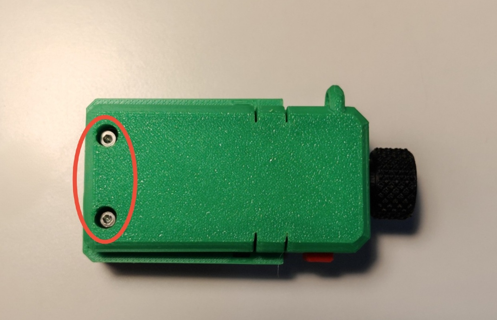<br>
2. Remove 2 screw with the hex 1.5mm.
<br>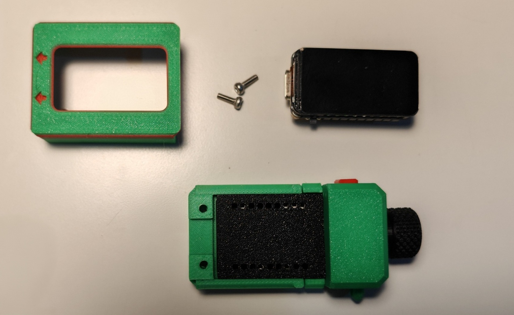<br>
3. Remove screen cover and took out the ESP32 module.
<br>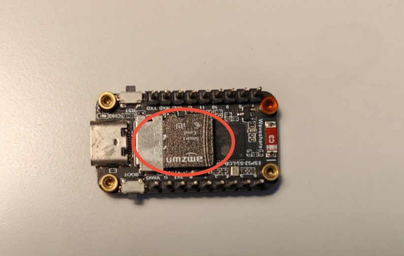<br>
4. Remove the SD card from the back of the ESP32 module.
5. Insert into a PC/phone (via reader/OTG).
6. Copy firmware files to `pocketPass/firmware/` as above.
7. Safely eject the SD card.
8. Reinsert into the device and screw it back securely (DO NOT OVER TIGHTEN THE SCREWS).

The update process on boot is the same as in Option A.

> For official releases, see:  
> [Pocket Pass Releases](https://github.com/limkokleong1985/pocket-pass/releases)

---

### Backups, recovery & device migration

[](https://www.youtube.com/watch?v=GKPrybibfoA)

#### What is stored where?

- **SD card (`vault.db`)**:
  - All encrypted categories, items, and password history.
- **Device NVS (internal flash)**:
  - Device‑unique secret.
  - PIN fail counters & lockout flag.
  - MSC/USB mode flags.
- **User‑held secrets**:
  - 6‑digit PIN.
  - Recovery Key (Base64 string shown once).

#### Backing up your vault

To back up your encrypted vault:

1. Power off the device and remove the SD card.
2. Copy the entire `pocketPass/` folder (especially `vault.db`) to a secure backup location.
3. Store backups in at least two secure places.

> Copying the SD card alone is **not enough** to decrypt your data, because keys are bound to your PIN and Recovery Key.

#### Restoring / migrating to another device

To move your data to a new Pocket Pass device:

1. On the **source** device:
   - Make sure you know your **PIN** and **Recovery Key**.
   - Copy the SD card (or move it) to the new device’s SD card slot.
2. On the **new** device:
   - Boot with the SD card inserted.
   - When it detects an existing vault, choose **Recovery Mode** if normal PIN login fails.
   - Enter **your PIN** and **Recovery Key** when prompted.

The recovery process:

- Uses PIN + Recovery Key to unwrap the vault key.
- Rebuilds normal PIN‑based access with the **new** device’s internal secret.
- Allows normal unlocks using your existing PIN on the new hardware.

> **Never** share your Recovery Key or PIN with anyone. Treat them like the master keys to your vault.

#### Plaintext exports

If you export to `/export/data.json`, you get **unencrypted**, human‑readable passwords. This is useful for:

- Migrating to a different password manager.
- Doing emergency manual backups.

But it is also dangerous:

- Anyone who obtains `data.json` has full access to all your services.
- Always delete plaintext exports as soon as you are done with them.

---

### Security features & limits

- **Strong cryptography**:
  - AES‑256‑GCM for encryption.
  - PBKDF2‑HMAC‑SHA256 with configurable iterations.
  - Device‑bounded keys derived from PIN + per‑device secret + salts.
  - Recovery path based on PIN + Recovery Key.
- **Signed firmware updates**:
  - Only firmware signed with the official key is accepted.
- **Auto‑lock**:
  - 5‑minute inactivity timeout; device wipes keys and reboots to PIN screen.
- **PIN fail limit**:
  - After several failed attempts, normal PIN login is locked.
  - Recovery Mode required to regain access.
  - Optional build flag can permanently scramble metadata on lockout (for high‑security variants).

---


### Troubleshooting

#### “DB open failed” or SD errors

- Make sure a good quality SD card is inserted.
- Ensure the `pocketPass/` directory exists (firmware will try to create it).
- Try reformatting the card (FAT32) and re‑inserting.

#### “Meta load fail” or “Name/label migration failed”

- These appear if the metadata table is corrupted or incompatible.
- Try restoring from a previous SD card backup.
- Do **not** modify `vault.db` manually unless you know exactly what you are doing.

### PC or smartphone doesn’t detect the device as a USB drive

When in **SD Card Mode** (Access SDCard, Import, Export):

- Use a **data‑capable** USB cable (not charge‑only).
- Try a different USB port or hub.
- On **smartphones/tablets**:
  - Make sure the device supports **USB OTG**.
  - Enable OTG in settings if required (some Android phones have a toggle like “OTG” or “USB storage”).
  - Use a proper **USB‑C OTG adapter** or USB‑A OTG cable.
- If still not detected:
  - Disconnect, power‑cycle the Pocket Pass device.
  - Re‑enter SD Card Mode and try again.

### PC or smartphone doesn’t react when sending passwords

When you use **`[ SEND PASSWORD ]`**:

- On PCs, the device should appear as a **USB keyboard**.
- Some smartphones/tablets:
  - May not accept external keyboards without OTG or proper permissions.
  - Require OTG to be enabled to recognize HID devices.
- Make sure the cursor/focus is in a password field when you trigger **SEND PASSWORD**.


#### Forgot Recovery Key but still have PIN

- Login.
- Go to **`[ SETTING ]`** and select **`[ UPDATE SECURITY ]`**

#### Forgot both PIN and Recovery Key

- There is no recovery possible by design.
- The only option is to wipe the SD card and start a new vault.

---

